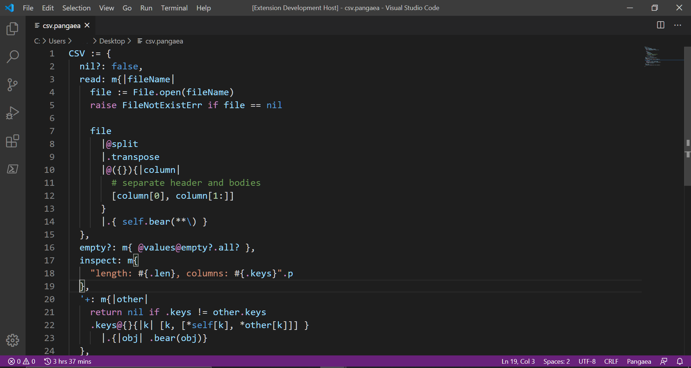

# pangaea-syntax-highlight README

[](LICENSE)
[](https://marketplace.visualstudio.com/items?itemName=Syuparn.pangaea-syntax-highlight)

VSCode Syntax Highlighting for Pangaea Language

(If you would like to know about Pangaea, see [https://github.com/Syuparn/Pangaea](https://github.com/Syuparn/Pangaea))

## Features

### Syntax Highlighting



### Snippets

- `func`: new Func object (`{|| }`)
- `iter`: new Iter object (`<{|| }>`)
- `m`: new method-form Func object (`m{|| }`)
- `m`: new method-form Iter object (`m<{|| }>`)

> **Tips:** These snippets recommend **tabsize 2**.
> 
> To change tabsize, open `settings.json` by `Preferences Open Settings(JSON)`
> in the command palette and add
> 
> ```
> "[pangaea]": {
>     "editor.tabSize": 2
> }, 
> ```
